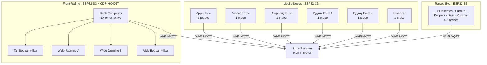

# Terrace IoT — Plant Moisture Monitoring System

A locally-hosted DIY sensor network that monitors soil moisture across container plants, raised beds, and mobile trees on a concrete terrace. The system is built around Home Assistant + MQTT and ESPHome firmware, with a strong emphasis on local data ownership, battery efficiency, and modular wiring that avoids trip hazards.

---

## Table of Contents

- [Architecture Overview](#architecture-overview)
- [Zones & Hardware](#zones--hardware)
  - [Zone 1 — Mobile / Discrete Nodes](#zone-1--mobile--discrete-nodes)
  - [Zone 2 — Raised Garden Bed](#zone-2--raised-garden-bed)
  - [Zone 3 — Front Railing Trunk](#zone-3--front-railing-trunk)
- [Technology Stack](#technology-stack)
- [Hardware Notes & Constraints](#hardware-notes--constraints)
- [Wiring & Power](#wiring--power)
- [ESPHome Configuration](#esphome-configuration)
- [Server Setup (HA + MQTT)](#server-setup-ha--mqtt)
- [Home Assistant Integration](#home-assistant-integration)
- [Future Work](#future-work)

---

## Architecture Overview

The physical layout of the terrace drives a hybrid **hub-and-spoke** (railing trunk) and **discrete node** (mobile planters) topology. No signal or power wires cross walkways.



---

## Zones & Hardware

### Zone 1 — Mobile / Discrete Nodes

Battery-powered, self-contained units attached directly to each movable planter. Designed to go months without maintenance once solar panels are added.

| Plant | Probes | MCU |
|---|---|---|
| Hybrid Apple Tree | 2 | ESP32-C3 |
| Avocado Tree | 1 | ESP32-C3 |
| Raspberry Bush | 1 | ESP32-C3 |
| Pygmy Palm (×2 planters) | 1 each | ESP32-C3 |
| Lavender | 1 | ESP32-C3 |

**Power chain:** 18650 Li-Ion → TP4056 (charge + protection) → HT7333-A LDO (3.3 V regulated)

**Firmware strategy:** ESPHome deep sleep — wake every ~15 minutes, read sensors, publish MQTT, sleep.

---

### Zone 2 — Raised Garden Bed

A semi-fixed ESP32-S3 node hidden under the bed lip monitors the distinct root zones of mixed vegetables and herbs.

| Plant | Notes |
|---|---|
| Blueberries | Needs consistently moist, acidic soil |
| Rainbow Carrots | Deep probe placement |
| Peppers | Moderate moisture, sensitive to overwatering |
| Basil | Frequent checking during heat |
| Zucchini | High water demand |

**Hardware:** ESP32-S3, 4–5 capacitive sensors wired to ADC1 pins, powered via mains or large battery pack.

---

### Zone 3 — Front Railing Trunk

A fixed line of planters running the length of the railing. Uses a **CD74HC4067 16-channel analog multiplexer** so a single ESP32-S3 reads 10 distinct root zones over one ADC pin.

**Power Bus strategy:** A single 18–20 AWG VCC/GND trunk runs the length of the railing. Each sensor taps VCC/GND from the bus locally; only the single `AOUT` signal wire from each sensor runs back to the multiplexer. This eliminates cable bundles.

| Plant | Zones |
|---|---|
| Tall Bougainvillea (×2) | 2 |
| Wide Jasmine (compartmentalized) | 4 |
| Wide Bougainvillea | 4 |

---

## Technology Stack

| Layer | Technology |
|---|---|
| Central Hub | Home Assistant |
| Message Broker | Eclipse Mosquitto (MQTT) |
| Firmware | ESPHome |
| Network | Wi-Fi (2.4 GHz) |
| Diagram / Schematic | Excalidraw, Fritzing, Mermaid.js |

---

## Hardware Notes & Constraints

### Capacitive Sensor Bypass (Critical)

Capacitive soil moisture sensors v1.2 include an onboard 5V→3.3V regulator for the 555 timer oscillator. When powered directly from the HT7333-A LDO (clean 3.3 V), this regulator must be **bypassed (bridged)** — otherwise the 555 timer receives ~1.8 V and the sensor reads incorrectly across the full range.

**Fix:** Bridge the input and output pads of the onboard LDO with a solder blob or a short wire jumper.

### ADC Pin Constraint

The ESP32's **ADC2** channels are multiplexed with the Wi-Fi radio and cannot be read reliably when Wi-Fi is active. **All analog sensors must connect to ADC1 pins only.**

| MCU | Board | Safe ADC1 Pins |
|---|---|---|
| ESP32-C3 | Seeed XIAO | D0/GPIO2, D1/GPIO3, D2/GPIO4 (GPIO0/1 not exposed; D3/GPIO5 is ADC2 — avoid) |
| ESP32-S3 | — | GPIO1 – GPIO10 |

### Waterproofing

- **Sensor heads:** Conformal coat the PCB edges and sensor head with silicone (e.g., MG Chemicals 422B). Do not coat the capacitive sensing area.
- **Enclosures:** IP67 junction boxes with PG7 cable glands for all wire ingress/egress.
- **Wire:** Silicone-insulated stranded wire (22–24 AWG) for UV resistance and flexibility.

---

## Wiring & Power

### Mobile Node Schematic (per node)

```
18650 Cell
   │
  [TP4056] ←── Solar Panel (5V, future)
   │ OUT+
  [HT7333-A LDO]
   │ 3.3V
  ┌┴─────────────────────┐
  │      ESP32-C3        │
  │  ADC1 ← Sensor AOUT  │
  │  3.3V → Sensor VCC*  │
  │  GND  → Sensor GND   │
  └──────────────────────┘

* Sensor onboard LDO must be bridged
```

### Railing Power Bus Schematic

```
Wall Power → [5V PSU] → 18–20 AWG VCC trunk ──────────────────────────────┐
                      → 18–20 AWG GND trunk ──────────────────────────────┐│
                                                                           ││
Sensor 1: VCC/GND tapped from bus; AOUT → CD74HC4067 CH0               ┌──┘│
Sensor 2: VCC/GND tapped from bus; AOUT → CD74HC4067 CH1               │   │
...                                                                      │   │
Sensor 10: VCC/GND tapped from bus; AOUT → CD74HC4067 CH9              │   │
                                                                         │   │
CD74HC4067: S0–S3 ← ESP32-S3 GPIO; SIG → ESP32-S3 ADC1; VCC/GND ──────┘   │
ESP32-S3: VCC/GND ─────────────────────────────────────────────────────────┘
```

---

## ESPHome Configuration

Configs are organized under `esphome/`:

```
esphome/
├── common/
│   └── base.yaml           # shared wifi, mqtt, logging, OTA
├── nodes/
│   ├── apple-tree.yaml     # Zone 1 — ESP32-C3, 2 probes + battery monitor
│   ├── avocado-tree.yaml   # Zone 1 — ESP32-C3, 1 probe
│   ├── raspberry-bush.yaml # Zone 1 — ESP32-C3, 1 probe
│   ├── pygmy-palm-1.yaml   # Zone 1 — ESP32-C3, 1 probe
│   ├── pygmy-palm-2.yaml   # Zone 1 — ESP32-C3, 1 probe
│   ├── lavender.yaml       # Zone 1 — ESP32-C3, 1 probe
│   ├── raised-bed.yaml     # Zone 2 — ESP32-S3, 4-5 probes
│   └── front-railing.yaml  # Zone 3 — ESP32-S3 + CD74HC4067, 10 zones
└── secrets.yaml            # gitignored — copy from secrets.yaml.template
```

### Setup

This project uses [uv](https://docs.astral.sh/uv/) for Python dependency management. Install it once if you don't have it:

```bash
curl -LsSf https://astral.sh/uv/install.sh | sh
```

Then:

1. Copy `secrets.yaml.template` to `esphome/secrets.yaml` and fill in your credentials.
2. Install dependencies: `uv sync`
3. Flash a node: `uv run esphome run esphome/nodes/apple-tree.yaml`
4. Subsequent updates are delivered OTA once the node is on Wi-Fi.

### Calibration

Each sensor needs wet/dry calibration. The raw ADC value at air (dry) and submerged (wet) will differ slightly between sensors. Record the raw values with:

```yaml
sensor:
  - platform: adc
    pin: GPIO3   # D1 on XIAO ESP32C3
    raw: true  # add temporarily to read uncalibrated voltage
```

Then update the `calibrate_linear` filter min/max in the node's YAML.

---

## Server Setup (HA + MQTT)

Home Assistant and Mosquitto run as Docker containers on the home desktop/server, managed by `compose.yaml` at the root of this repo. Full setup instructions, including Tailscale subnet routing, are in **[docs/server-setup.md](docs/server-setup.md)**.

Quick start (after completing the one-time steps in that doc):

```bash
docker compose up -d
```

HA will be available at `http://localhost:8123`.

---

## Home Assistant Integration

ESPHome nodes publish sensor readings to the Mosquitto MQTT broker. Home Assistant auto-discovers them via the MQTT integration.

Recommended dashboard cards per zone:
- **Gauge card** — current moisture % per probe
- **History graph** — 24h trend per plant
- **Alert automation** — notify when moisture drops below threshold

Example automation trigger (YAML):

```yaml
trigger:
  - platform: numeric_state
    entity_id: sensor.apple_tree_zone_1_moisture
    below: 30
action:
  - service: notify.mobile_app
    data:
      message: "Apple Tree Zone 1 is dry — check soil."
```

---

## Future Work

- [ ] Add 5V mini solar panels to all mobile nodes (TP4056 charge input is pre-staged)
- [ ] Excalidraw wiring diagrams for each zone (see `docs/`)
- [ ] Fritzing schematics for the railing power bus and multiplexer board
- [ ] Per-sensor calibration values documented in `docs/calibration.md`
- [ ] Home Assistant dashboard YAML export
- [ ] Rain sensor integration to skip irrigation alerts after precipitation
