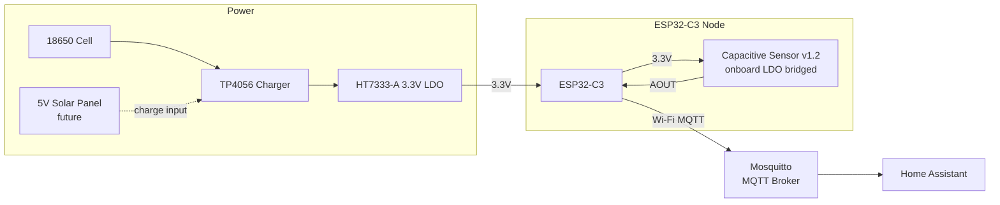
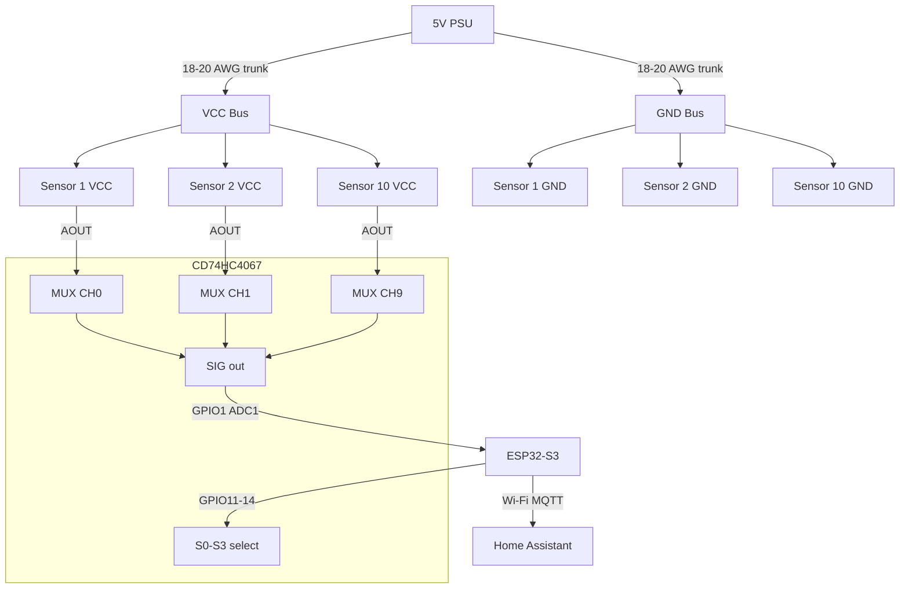

# Architecture & Wiring Notes

Diagrams here are rendered with Mermaid.js. Most Markdown previewers (GitHub, VS Code with extension, Obsidian) render these natively.

## System Topology



## Multiplexer Wiring (Front Railing)



## Deep Sleep Power Budget (per mobile node)

| State | Current Draw | Duration |
|---|---|---|
| Active (Wi-Fi + ADC) | ~80 mA | 30 s |
| Deep Sleep | ~10 µA | 15 min |
| **Avg over cycle** | **~2.8 mA** | — |

A 2500 mAh 18650 cell at this average gives roughly **37 days** of runtime without solar.
With a 100 mA solar panel in 4 peak sun hours/day, the node runs indefinitely.

## Sensor Bypass Detail

```
Sensor v1.2 PCB (top view, schematic):

VCC_IN ──[LDO 5V→3.3V]──> VCC_3V3 ──> 555 Timer ──> CD ──> AOUT
                              ↑
                           [bridge this with solder]
                              |
VCC_IN ────────────────────────

Bridging connects VCC_IN directly to the 555 timer supply,
bypassing the LDO. Feed 3.3V to VCC_IN; the timer sees 3.3V.
```

## Pin Assignment Summary

### ESP32-C3 (Mobile Nodes)

| GPIO | Function |
|---|---|
| GPIO0 | Reserved (boot strapping) |
| GPIO1 | ADC1 — Sensor 1 AOUT |
| GPIO2 | ADC1 — Sensor 2 AOUT (apple tree only) |
| GPIO3 | ADC1 — Battery voltage divider |
| GPIO4 | ADC1 — spare |

### ESP32-S3 (Raised Bed)

| GPIO | Function |
|---|---|
| GPIO1 | ADC1 — Blueberries |
| GPIO2 | ADC1 — Carrots |
| GPIO3 | ADC1 — Peppers |
| GPIO4 | ADC1 — Basil |
| GPIO5 | ADC1 — Zucchini |

### ESP32-S3 (Front Railing + Multiplexer)

| GPIO | Function |
|---|---|
| GPIO1 | ADC1 — MUX SIG input |
| GPIO11 | Digital OUT — MUX S0 |
| GPIO12 | Digital OUT — MUX S1 |
| GPIO13 | Digital OUT — MUX S2 |
| GPIO14 | Digital OUT — MUX S3 |
